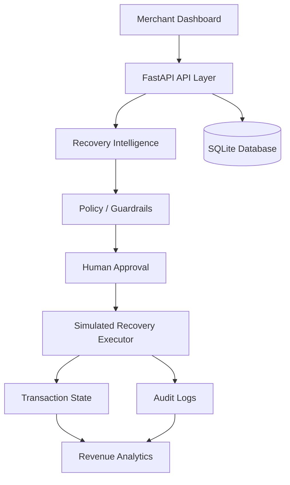

# RecoverAI

## AI-Powered Revenue Recovery Platform

RecoverAI is a merchant operations MVP for identifying at-risk revenue, explaining payment failures, recommending bounded recovery actions, and keeping every decision auditable. It uses synthetic data, deterministic intelligence, and simulated/test-mode recovery operations.

## 1. Problem

Failed, abandoned, and at-risk transactions represent potential lost revenue. Merchants need a system that can identify exposure, understand failure causes, estimate recovery potential, choose an appropriate action, apply guardrails, involve people when necessary, and maintain an audit trail.

## 2. Solution

RecoverAI combines transaction intelligence, risk scoring, diagnosis, recovery probability estimation, decisioning, policy guardrails, human approval, simulated recovery execution, revenue analytics, audit logging, and a merchant dashboard.

The intelligence layer is a transparent deterministic baseline for demonstration and testing, not a trained machine-learning model. Recovery actions are simulated and do not move real funds.

## 3. Key Features

- Revenue-at-risk detection and current-vs-initial revenue metrics
- Risk scoring and failure diagnosis
- Baseline recovery probability estimation
- Explainable recovery recommendations
- Allowlisted policy and guardrail engine
- Human approval and rejection workflow
- Bounded deterministic recovery execution
- Retry stopping rules and escalation
- Recovery history and audit trail
- Responsive merchant dashboard and analytics
- Transaction search, filters, pagination, and detail views
- 400 synthetic customers and 2,000 synthetic transactions
- Test-mode simulation with no payment or messaging providers

## 4. Architecture



- **Frontend:** React, React Router, Axios, Recharts, Tailwind CSS, and webpack provide the merchant workspace.
- **API layer:** FastAPI exposes transaction, customer, intelligence, execution, approval, history, analytics, and audit endpoints.
- **Database:** SQLAlchemy persists synthetic customers, transactions, recovery attempts, and audit logs in SQLite.
- **Intelligence:** Risk, diagnosis, probability, and decision components produce structured recommendations.
- **Policy:** Backend guardrails enforce allowlisted actions, retry limits, terminal-state protection, escalation, and approval requirements.
- **Execution:** The executor produces deterministic test-mode outcomes only.
- **Analytics:** Summary metrics distinguish initial revenue at risk, current outstanding risk, recovered revenue, and recovery rate.

## 5. AI / Intelligence Flow

```text
Transaction
  -> Risk Analysis
  -> Diagnosis
  -> Recovery Probability
  -> Decision Engine
  -> Policy Check
  -> Human Approval if required
  -> Simulated Recovery Execution
  -> Audit
  -> Analytics
```

The Phase 3 intelligence layer is a transparent deterministic baseline designed for demonstration and testing. It does not claim to use an LLM or trained ML model.

## 6. Safety / Guardrails

- Automatic payment retries stop at two attempts.
- High-value transactions use the configurable `HIGH_VALUE_THRESHOLD` and require approval.
- Critical risk, repeated failures, and explicit human escalation require human review or stop automation.
- Successful, recovered, escalated, and not-recoverable transactions cannot be recovered again.
- Only allowlisted recovery actions are accepted.
- Policy checks run in the backend before execution and again during approval.
- Every recommendation, approval, rejection, block, execution, and state transition is auditable.

**All payment and recovery operations in this MVP are simulated/test-mode operations and do not move real funds.**

## 7. Tech Stack

**Backend:** Python, FastAPI, SQLAlchemy, SQLite, Pydantic, Pytest

**Frontend:** React, JavaScript, Axios, Recharts, Tailwind CSS, webpack

## 8. Project Structure

```text
RecoverAI/
├── backend/
│   ├── app/
│   │   ├── agents/       # Risk, diagnosis, decision, policy, recovery facade
│   │   ├── api/          # Transaction and recovery routes
│   │   ├── models/       # SQLAlchemy entities
│   │   ├── schemas/      # Pydantic response/request models
│   │   └── services/     # Analytics and simulated execution
│   ├── data/             # Synthetic data generator
│   └── tests/            # Phase 3 and Phase 4 tests
├── docs/
├── frontend/
│   ├── src/components/
│   ├── src/pages/
│   ├── src/services/
│   └── src/hooks/
├── DEMO_SCRIPT.md
└── docker-compose.yml
```

Generated files such as `node_modules`, `dist`, `.venv`, `__pycache__`, and local database files are excluded from the repository.

## 9. Getting Started

### Backend on Windows

```powershell
cd backend
python -m venv .venv
.venv\Scripts\activate
pip install -r requirements.txt
python data\generate_data.py
uvicorn app.main:app --reload --host 0.0.0.0 --port 8000
```

The data generator creates the deterministic synthetic SQLite dataset. Use the existing database if it has already been seeded.

### Frontend

```powershell
cd frontend
npm install
npm run dev -- --host 0.0.0.0
```

The frontend defaults to `http://127.0.0.1:8000`. To point it elsewhere, copy `.env.example` to `.env` and set `API_BASE_URL`. Webpack injects this value at build time.

Open `http://localhost:5173` for the dashboard.

## 10. Demo

1. Open the Dashboard and review the live revenue metrics.
2. Open `TXN-000051` at `/transactions/51`.
3. Click **Analyze Transaction**.
4. Review risk, probability, diagnosis, action, confidence, and guardrails.
5. Click **Execute Recovery** and confirm the simulation.
6. Return to Dashboard and click **Refresh**.
7. Open Audit Trail and expand the transaction events.

On a freshly seeded dataset, the primary demo transaction is `TXN-000051` / ID `51`: a failed network error with retry count `0`, risk `MEDIUM`, recovery probability approximately `0.83`, and recommended action `RETRY_PAYMENT`. The checked-in local database may contain prior verification artifacts.

## 11. API Overview

**Health**

- `GET /health`

**Transactions and customers**

- `GET /api/transactions`
- `GET /api/transactions/{transaction_id}`
- `GET /api/customers`
- `GET /api/customers/{customer_id}`

**Recovery intelligence and execution**

- `POST /api/recovery/analyze/{transaction_id}`
- `GET /api/recovery/at-risk`
- `POST /api/recovery/execute/{transaction_id}`
- `POST /api/recovery/attempts/{attempt_id}/approve`
- `POST /api/recovery/attempts/{attempt_id}/reject`
- `GET /api/recovery/transactions/{transaction_id}/history`

**Analytics**

- `GET /api/recovery/summary`

**Recovery records and audit**

- `GET /api/recovery-attempts`
- `GET /api/audit-logs`

## 12. Testing

The verified backend suite contains **19 passed, 0 failed, 0 errors**. The frontend production bundle has also been verified with `npm run build`. Webpack may report a non-blocking bundle-size warning due to Recharts.

## 13. Example Metrics

These are example synthetic/test-mode metrics from the verified demo database and are not real merchant results:

- Initial revenue at risk: `₹83,99,306.68`
- Current revenue at risk: `₹83,89,126.70`
- Recovered revenue: `₹6,406.39`
- Recovery rate: `0.08%`
- At-risk transactions: `711`
- Recovery attempts: `107`

## 14. Limitations

- The dataset is synthetic.
- Recovery execution is simulated and deterministic.
- Intelligence is a deterministic baseline, not a trained ML model.
- No real funds move.
- No production payment credentials or gateways are used.
- No production email or SMS messaging is integrated.

## 15. Future Improvements

- Train and monitor a recovery prediction model
- Learn merchant-specific policies
- Integrate payment providers in a separately secured production system
- Add production messaging integrations
- Support richer experiments and merchant-specific optimization

## Screenshots

Recommended capture targets are documented in [docs/screenshots/README.md](docs/screenshots/README.md). No fabricated screenshot files are included.
