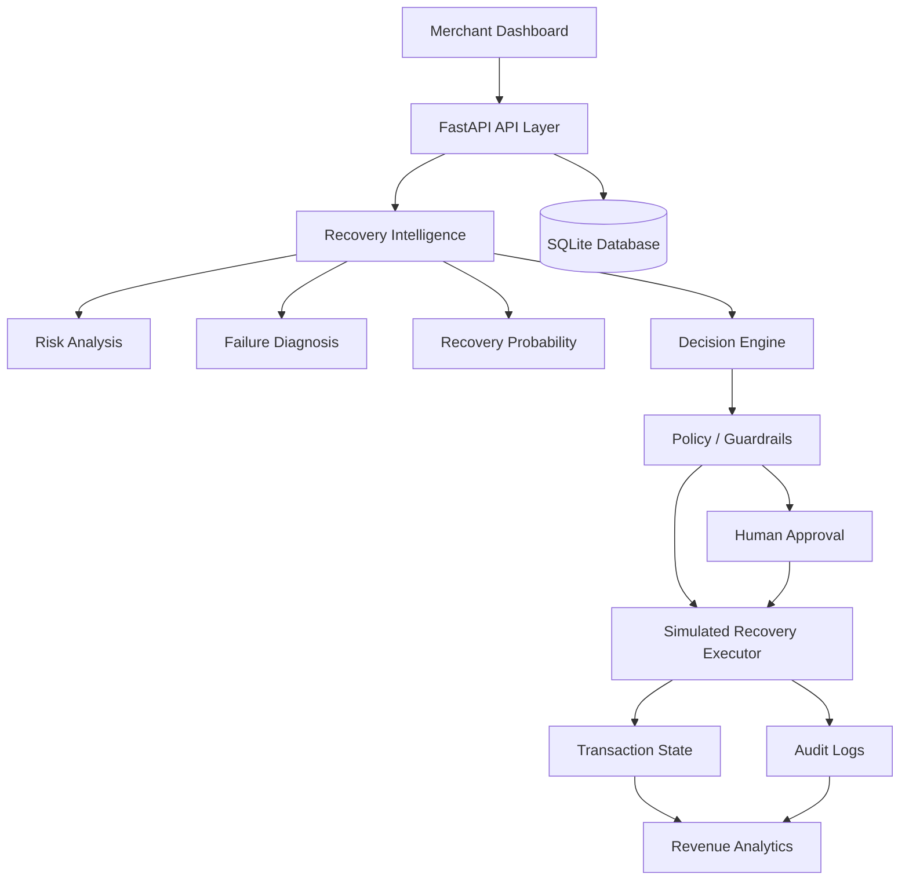

# RecoverAI

## AI-Powered Revenue Recovery Platform

RecoverAI is a merchant operations MVP for identifying at-risk revenue, explaining payment failures, recommending bounded recovery actions, and keeping every decision auditable.

The platform combines transaction intelligence, risk scoring, failure diagnosis, recovery probability estimation, policy guardrails, human approval workflows, simulated recovery execution, analytics, and audit logging.

RecoverAI currently operates using **synthetic data**, a **transparent deterministic intelligence baseline**, and **Simulation / Test Mode**. No real payments or funds are processed.

---

## 1. Problem

Failed, abandoned, and at-risk transactions represent potential lost revenue for merchants.

Merchants need a system that can:

- Identify revenue exposure
- Detect at-risk transactions
- Understand payment failure causes
- Estimate recovery potential
- Recommend an appropriate recovery action
- Apply business and safety guardrails
- Escalate cases to humans when necessary
- Execute bounded recovery actions
- Track recovery outcomes
- Maintain a complete audit trail

RecoverAI is designed to demonstrate this complete revenue recovery workflow in a controlled test environment.

---

## 2. Solution

RecoverAI provides an end-to-end merchant recovery workspace.

The platform combines:

- Transaction intelligence
- Risk scoring
- Failure diagnosis
- Recovery probability estimation
- Recovery decisioning
- Policy and guardrail checks
- Human approval and rejection
- Simulated recovery execution
- Recovery history
- Revenue analytics
- Audit logging
- Merchant dashboards

The intelligence layer is implemented as a **transparent deterministic baseline** for demonstration and testing. It is not presented as a trained machine-learning model or an LLM.

All recovery operations are simulated and do not move real funds.

---

## 3. Key Features

### Revenue Intelligence

- Revenue-at-risk detection
- Initial vs current revenue-at-risk metrics
- Recovered revenue tracking
- Recovery-rate calculation
- At-risk transaction identification

### Transaction Intelligence

- Transaction search
- Customer search
- Status filtering
- Risk filtering
- Transaction-type filtering
- Failure-reason filtering
- Pagination
- Transaction detail views
- Failure diagnosis

### AI / Recovery Intelligence

- Risk scoring
- Failure diagnosis
- Recovery probability estimation
- Explainable recovery recommendations
- Confidence scoring
- Decision factors
- Recommended recovery actions

### Policy & Guardrails

- Allowlisted recovery actions
- Retry limits
- Terminal-state protection
- High-value transaction controls
- Critical-risk protection
- Human escalation
- Approval requirements
- Backend policy validation

### Recovery Operations

- Simulated recovery execution
- Recovery attempt tracking
- Recovery history
- Successful recovery tracking
- Failed recovery tracking
- Blocked recovery tracking
- Human escalation tracking

### Auditability

- AI-agent events
- Policy-engine events
- Human-review events
- Recovery recommendations
- Approval events
- Rejection events
- Policy blocks
- Execution results
- Transaction state transitions

### Analytics

- Revenue performance
- Risk distribution
- Recovery outcomes
- Failure-reason distribution
- Transaction-type distribution
- Recovery attempts
- Successful recoveries
- Failures
- Escalations
- Blocked actions

### Test Environment

- 400 synthetic customers
- 2,000 synthetic transactions
- Deterministic synthetic dataset
- Simulation / Test Mode
- No real payment providers
- No real messaging providers
- No real funds movement


## 4. Architecture



- **Frontend:** React, React Router, Axios, Recharts, Tailwind CSS, and webpack provide the merchant workspace.
- **API layer:** FastAPI exposes transaction, customer, intelligence, execution, approval, history, analytics, and audit endpoints.
- **Database:** SQLAlchemy persists synthetic customers, transactions, recovery attempts, and audit logs in SQLite.
- **Intelligence:** Risk, diagnosis, probability, and decision components produce structured recommendations.
- **Policy:** Backend guardrails enforce allowlisted actions, retry limits, terminal-state protection, escalation, and approval requirements.
- **Execution:** The executor produces deterministic test-mode outcomes only.
- **Analytics:** Summary metrics distinguish initial revenue at risk, current outstanding risk, recovered revenue, and recovery rate.

---

## 5. Screenshots

The following screenshots demonstrate the main RecoverAI workflow running in Simulation / Test Mode.

### Dashboard


Main merchant dashboard showing revenue-at-risk metrics, recovery KPIs, risk distribution, recovery outcomes, and recovery performance.

### Transactions


Transaction listing with customer information, amounts, status, failure reason, risk, recovery probability, search, and filtering.

### Transaction Detail


Transaction detail view showing transaction information, retry status, guardrail state, and recovery history.

### AI Recovery Analysis


AI recovery analysis showing risk score, recovery probability, recommended recovery action, confidence, decision factors, and approval requirement.

### Recovery Center


Recovery operations workspace showing revenue at risk, recovery attempts, successful recoveries, pending approvals, and the at-risk transaction queue.

### Analytics


Analytics dashboard showing revenue performance, risk distribution, recovery outcomes, failure-reason distribution, and transaction-type distribution.

### Audit Trail


Audit trail showing AI-agent, policy-engine, and human-review events and their resulting states.


---

## 6. AI / Intelligence Flow

```text
Transaction
  -> Risk Analysis
  -> Diagnosis
  -> Recovery Probability
  -> Decision Engine
  -> Policy Check
  -> Human Approval if required
  -> Simulated Recovery Execution
  -> Audit
  -> Analytics


## 7. Safety / Guardrails

RecoverAI is designed with bounded recovery operations and human oversight.

Automatic payment retries stop at two attempts.
High-value transactions use the configurable HIGH_VALUE_THRESHOLD and require human approval.
Critical risk, repeated failures, and explicit human escalation require human review or stop automation.
Successful, recovered, escalated, and not-recoverable transactions cannot be recovered again.
Only allowlisted recovery actions are accepted.
Policy checks run in the backend before execution and again during approval.
Every recommendation, approval, rejection, block, execution, and state transition is auditable.

All payment and recovery operations in this MVP are simulated/test-mode operations and do not move real funds.


## 8. Tech Stack

Backend: Python, FastAPI, SQLAlchemy, SQLite, Pydantic, Pytest

Frontend: React, JavaScript, Axios, Recharts, Tailwind CSS, webpack

## 9. Project Structure

RecoverAI/
├── backend/
│   ├── app/
│   │   ├── agents/       # Risk, diagnosis, decision, policy, recovery facade
│   │   ├── api/          # Transaction and recovery routes
│   │   ├── models/       # SQLAlchemy entities
│   │   └── schemas/      # Pydantic response/request models
│   │   └── services/     # Analytics and simulated execution
│   ├── data/             # Synthetic data generator
│   └── tests/            # Phase 3 and Phase 4 tests
├── docs/
├── frontend/
│   ├── src/components/
│   ├── src/pages/
│   ├── src/services/
│   └── src/hooks/
├── DEMO_SCRIPT.md
└── docker-compose.yml
Generated files such as node_modules, dist, .venv, __pycache__, and local database files are excluded from the repository.

## 10. Getting Started

### Backend on Windows

```powershell
cd backend
python -m venv .venv
.venv\Scripts\activate
pip install -r requirements.txt
python data\generate_data.py
uvicorn app.main:app --reload --host 127.0.0.1 --port 8000
```

The data generator creates the deterministic synthetic SQLite dataset. Use the existing database if it has already been seeded.

### Frontend

Open another terminal:

```powershell
cd frontend
npm install
npm run dev
```

The frontend development server runs on port `5173` and the backend runs on port `8000`.

Open:

```text
http://localhost:5173
```

---

## 11. Demo

1. Open the Dashboard and review the revenue-at-risk metrics.
2. Open the Transactions page.
3. Select a failed transaction.
4. Click **Analyze Transaction**.
5. Review risk, recovery probability, diagnosis, recommended action, confidence, and guardrails.
6. Review the recovery action or human-approval requirement.
7. Open Recovery Center to review recovery activity.
8. Open Audit Trail to inspect the decision and execution history.
9. Open Analytics to review recovery performance and transaction distributions.

All recovery operations shown in the demo are simulated/test-mode operations.

---

## 12. API Overview

### Health

- `GET /health`

### Transactions and Customers

- `GET /api/transactions`
- `GET /api/transactions/{transaction_id}`
- `GET /api/customers`
- `GET /api/customers/{customer_id}`

### Recovery Intelligence and Execution

- `POST /api/recovery/analyze/{transaction_id}`
- `GET /api/recovery/at-risk`
- `POST /api/recovery/execute/{transaction_id}`
- `POST /api/recovery/attempts/{attempt_id}/approve`
- `POST /api/recovery/attempts/{attempt_id}/reject`
- `GET /api/recovery/transactions/{transaction_id}/history`

### Analytics

- `GET /api/recovery/summary`

### Recovery Records and Audit

- `GET /api/recovery-attempts`
- `GET /api/audit-logs`

---

## 13. Testing

The verified backend test suite contains:

- **19 passed**
- **0 failed**
- **0 errors**

The frontend production build has also been verified successfully.

Webpack may report a non-blocking bundle-size warning related to Recharts.

---

## 14. Example Metrics

The following are synthetic/test-mode metrics from the verified demo database and are not real merchant results:

- Initial revenue at risk: `₹83,99,306.68`
- Current revenue at risk: `₹83,89,126.70`
- Recovered revenue: `₹6,406.39`
- Recovery rate: `0.08%`
- At-risk transactions: `711`
- Recovery attempts: `107`
- Successful recoveries: `42`
- Failed recoveries: `30`
- Escalations: `1`
- Blocked actions: `33`

---

## 15. Limitations

- The dataset is synthetic.
- Recovery execution is simulated and deterministic.
- Intelligence is a deterministic baseline, not a trained ML model.
- No real funds move.
- No production payment credentials or gateways are used.
- No production email or SMS messaging is integrated.

---

## 16. Future Improvements

- Train and monitor a recovery prediction model.
- Learn merchant-specific recovery policies.
- Integrate payment providers in a separately secured production system.
- Add production messaging integrations.
- Support richer experiments and merchant-specific optimization.