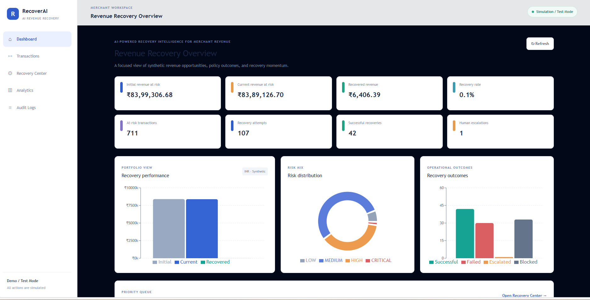
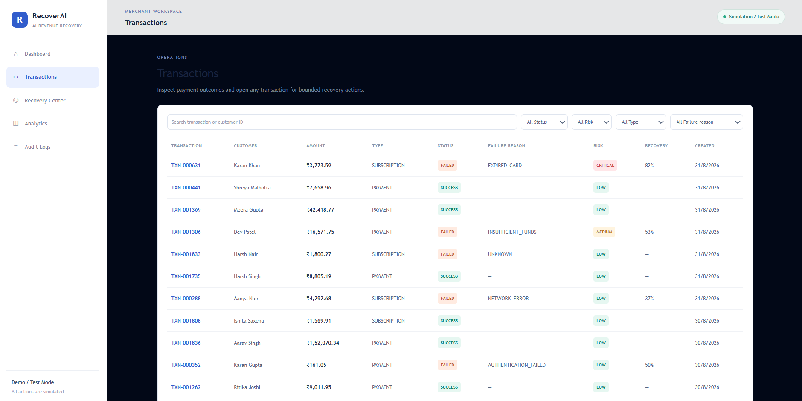
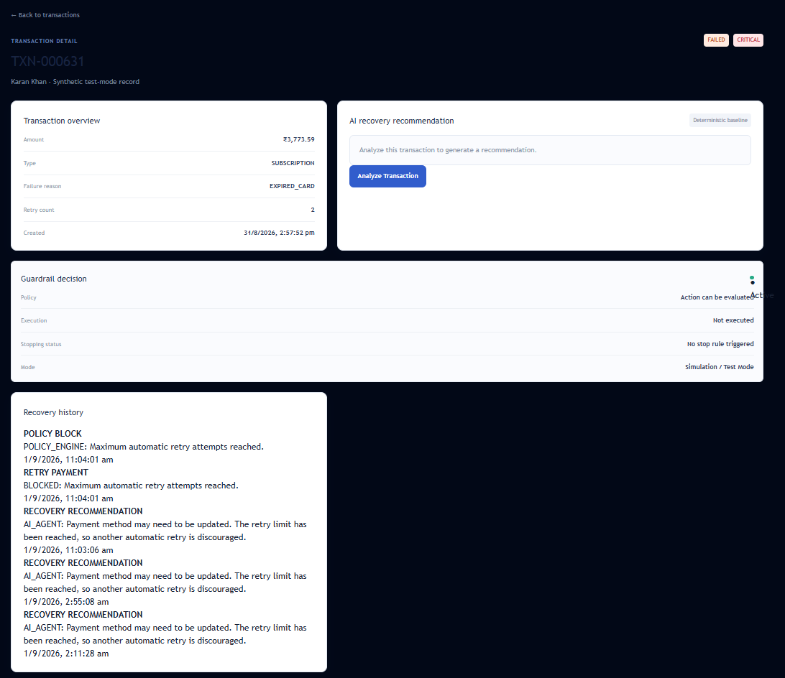
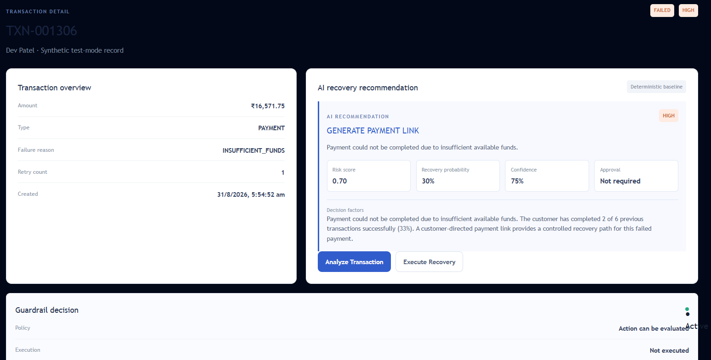
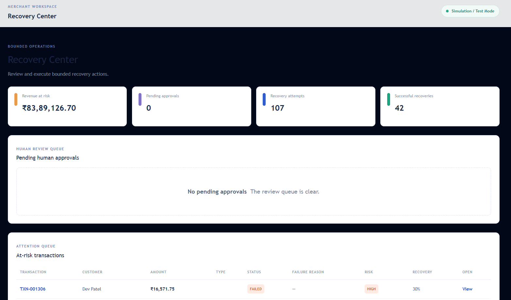
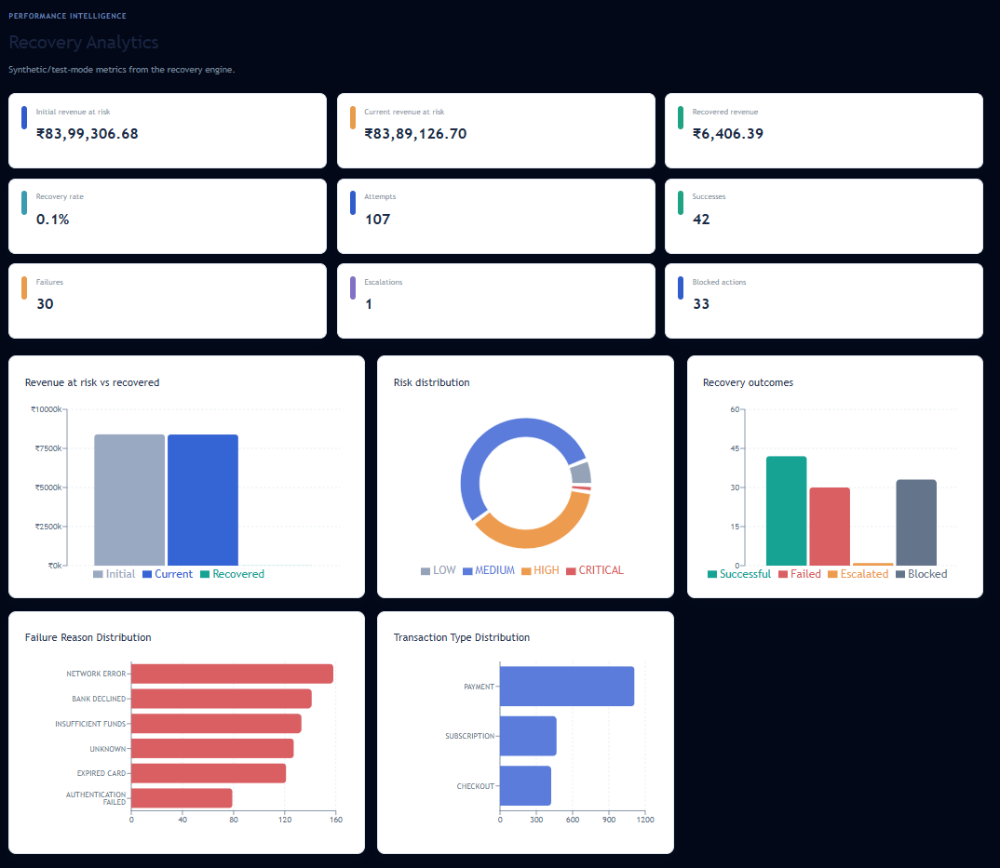
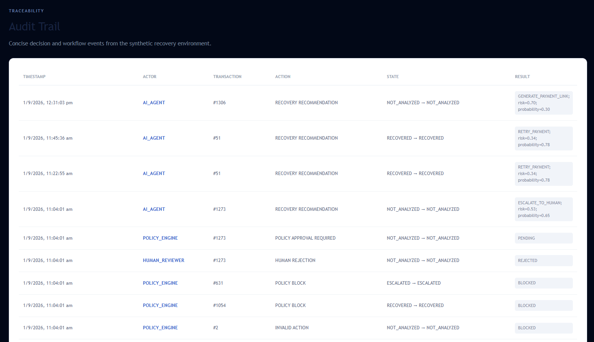

# RecoverAI

## AI-Powered Revenue Recovery Platform

RecoverAI is a merchant operations MVP for identifying at-risk revenue, explaining payment failures, recommending bounded recovery actions, and keeping every decision auditable.

The platform combines transaction intelligence, risk scoring, failure diagnosis, recovery probability estimation, policy guardrails, human approval workflows, simulated recovery execution, analytics, and audit logging.

RecoverAI currently operates using **synthetic data**, a **transparent deterministic intelligence baseline**, and **Simulation / Test Mode**. No real payments or funds are processed.

---

## 1. Problem

Failed, abandoned, and at-risk transactions represent potential lost revenue for merchants.

Merchants need a system that can:

- Identify revenue exposure
- Detect at-risk transactions
- Understand payment failure causes
- Estimate recovery potential
- Recommend an appropriate recovery action
- Apply business and safety guardrails
- Escalate cases to humans when necessary
- Execute bounded recovery actions
- Track recovery outcomes
- Maintain a complete audit trail

RecoverAI is designed to demonstrate this complete revenue recovery workflow in a controlled test environment.

---

## 2. Solution

RecoverAI provides an end-to-end merchant recovery workspace.

The platform combines:

- Transaction intelligence
- Risk scoring
- Failure diagnosis
- Recovery probability estimation
- Recovery decisioning
- Policy and guardrail checks
- Human approval and rejection
- Simulated recovery execution
- Recovery history
- Revenue analytics
- Audit logging
- Merchant dashboards

The intelligence layer is implemented as a **transparent deterministic baseline** for demonstration and testing. It is not presented as a trained machine-learning model or an LLM.

All recovery operations are simulated and do not move real funds.

---

# 3. Key Features

### Revenue Intelligence

- Revenue-at-risk detection
- Initial vs current revenue-at-risk metrics
- Recovered revenue tracking
- Recovery-rate calculation
- At-risk transaction identification

### Transaction Intelligence

- Transaction search
- Customer search
- Status filtering
- Risk filtering
- Transaction-type filtering
- Failure-reason filtering
- Pagination
- Transaction detail views
- Failure diagnosis

### AI / Recovery Intelligence

- Risk scoring
- Failure diagnosis
- Recovery probability estimation
- Explainable recovery recommendations
- Confidence scoring
- Decision factors
- Recommended recovery actions

### Policy & Guardrails

- Allowlisted recovery actions
- Retry limits
- Terminal-state protection
- High-value transaction controls
- Critical-risk protection
- Human escalation
- Approval requirements
- Backend policy validation

### Recovery Operations

- Simulated recovery execution
- Recovery attempt tracking
- Recovery history
- Successful recovery tracking
- Failed recovery tracking
- Blocked recovery tracking
- Human escalation tracking

### Auditability

- AI-agent events
- Policy-engine events
- Human-review events
- Recovery recommendations
- Approval events
- Rejection events
- Policy blocks
- Execution results
- Transaction state transitions

### Analytics

- Revenue performance
- Risk distribution
- Recovery outcomes
- Failure-reason distribution
- Transaction-type distribution
- Recovery attempts
- Successful recoveries
- Failures
- Escalations
- Blocked actions

### Test Environment

- 400 synthetic customers
- 2,000 synthetic transactions
- Deterministic synthetic dataset
- Simulation / Test Mode
- No real payment providers
- No real messaging providers
- No real funds movement

---

# 4. Architecture

```mermaid
flowchart TD
    Dashboard[Merchant Dashboard] --> API[FastAPI API Layer]

    API --> Intelligence[Recovery Intelligence]
    API --> DB[(SQLite Database)]

    Intelligence --> Risk[Risk Analysis]
    Intelligence --> Diagnosis[Failure Diagnosis]
    Intelligence --> Probability[Recovery Probability]
    Intelligence --> Decision[Decision Engine]

    Decision --> Policy[Policy / Guardrails]

    Policy --> Approval[Human Approval]
    Policy --> Executor[Simulated Recovery Executor]

    Approval --> Executor

    Executor --> State[Transaction State]
    Executor --> Audit[Audit Logs]

    State --> Analytics[Revenue Analytics]
    Audit --> Analytics


---

## 5. Screenshots

The following screenshots demonstrate the main RecoverAI workflow running in Simulation / Test Mode.

### Dashboard



Main merchant dashboard showing revenue-at-risk metrics, recovery KPIs, risk distribution, recovery outcomes, and recovery performance.

### Transactions



Transaction listing with customer information, amounts, status, failure reason, risk, recovery probability, search, and filtering.

### Transaction Detail



Transaction detail view showing transaction information, retry status, guardrail state, and recovery history.

### AI Recovery Analysis



AI recovery analysis showing risk score, recovery probability, recommended recovery action, confidence, decision factors, and approval requirement.

### Recovery Center



Recovery operations workspace showing revenue at risk, recovery attempts, successful recoveries, pending approvals, and the at-risk transaction queue.

### Analytics



Analytics dashboard showing revenue performance, risk distribution, recovery outcomes, failure-reason distribution, and transaction-type distribution.

### Audit Trail



Audit trail showing AI-agent, policy-engine, and human-review events and their resulting states.