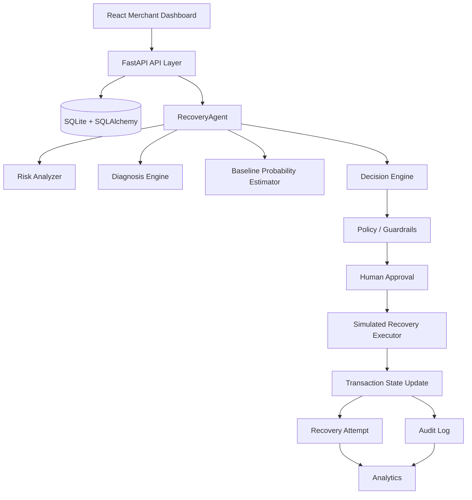

# RecoverAI Architecture

## 1. System Overview

RecoverAI is a synthetic-data merchant operations application for explaining transaction risk and running bounded recovery simulations. The React dashboard calls a FastAPI backend, which coordinates deterministic intelligence, policy checks, simulated execution, persistence, audit logging, and analytics.



## 2. Frontend Architecture

The frontend is a webpack-served React single-page application. `Layout` owns navigation and responsive shell behavior. Pages provide dashboard, transactions, transaction details, recovery center, analytics, and audit views. Shared components provide tables, badges, charts, timelines, states, and recommendation panels. `services/api.js` contains the Axios client and actual backend endpoint functions. `useApi.js` centralizes loading and safe error handling.

## 3. Backend Architecture

- `app/main.py` creates the FastAPI application, configures CORS, initializes the database, and registers routers.
- `app/api/transactions.py` exposes Phase 2 read APIs.
- `app/api/recovery.py` exposes analysis, execution, approval, history, and summary APIs.
- `app/agents/` contains deterministic risk, diagnosis, decision, policy, and orchestration components.
- `app/services/` contains analytics and the test-mode recovery executor.
- `app/schemas/` defines validated API contracts.

## 4. Database Layer

SQLAlchemy models persist customers, transactions, recovery attempts, and audit logs in SQLite. The seeded dataset contains 400 customers and 2,000 transactions. Phase 4 uses the existing tables; recovery execution records attempts and audit events without introducing a separate production payments schema.

## 5. Intelligence Layer

The request flow is:

```text
Transaction
  -> Risk Analyzer
  -> Diagnosis Engine
  -> Baseline Recovery Probability
  -> Decision Engine
  -> Structured Recommendation
```

Risk scoring considers amount, status, failure reason, retry count, transaction type, and customer history. Diagnosis returns concise failure explanations. The probability estimator is deterministic and explicitly a baseline, not a trained model. `RecoveryAgent` is the stable interface that could later be backed by another implementation.

## 6. Policy and Guardrails

`PolicyEngine` runs before simulated execution and again before human-approved execution. It enforces the allowlist, maximum automatic retry attempts of two, terminal transaction protection, repeated-failure escalation, high-value approval, critical-risk approval, and explicit human escalation. The frontend is not a security boundary.

## 7. Recovery Execution

`RecoveryExecutor` supports retry, payment-link, reminder, alternative-payment, escalation, and no-action outcomes. Outcomes are deterministic based on transaction properties and identifiers, so the demo is reproducible. Every result is labeled as simulated/test-mode behavior and no provider, credential, payment rail, email service, or SMS service is called.

## 8. Human Approval

Actions requiring approval create a pending `RecoveryAttempt` and stop before execution. Approval rechecks the transaction and policy. Rejection marks the attempt rejected, leaves the transaction unrecovered, and writes an audit event. High-value, critical-risk, repeated-failure, and escalation cases are handled by backend policy.

## 9. Audit Logging

The backend records recommendation, policy, human review, execution, result, block, escalation, and stopping events with actor, action, state transition, concise reason, result, and structured metadata. Hidden chain-of-thought is not stored or displayed.

## 10. Analytics

The summary distinguishes:

- **Initial revenue at risk:** qualifying failed or abandoned transaction value at baseline eligibility.
- **Current revenue at risk:** currently outstanding qualifying value, excluding recovered, escalated, and not-recoverable transactions.
- **Recovered revenue:** each transaction amount with `recovery_status=RECOVERED`, counted once.
- **Recovery rate:** `recovered_revenue / initial_revenue_at_risk`, protected against division by zero.

## 11. End-to-End Request Flow

```text
Dashboard request
  -> FastAPI route
  -> SQLAlchemy transaction/customer query
  -> RecoveryAgent recommendation
  -> Policy Engine
  -> Human Approval when required
  -> Recovery Executor
  -> Transaction State
  -> Recovery Attempt
  -> Audit Log
  -> Analytics summary
```

## 12. Safety Boundaries

All payment and recovery operations in this MVP are simulated/test-mode operations and do not move real funds. The repository uses synthetic data only, does not contain production credentials, and does not integrate production payment or messaging systems. Backend policy checks, server-side transaction amounts, allowlisted actions, retry limits, terminal-state protection, and audit logs enforce the primary safety boundaries.
